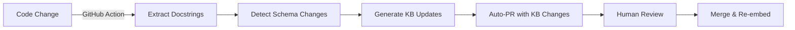

# 📚 Knowledge Base Freshness Analysis

**Date**: October 8, 2025  
**Question**: "How good is this product at displaying the most up-to-date version when asked how it works?"

---

## 🎯 TL;DR: Current State Assessment

**Rating**: ⚠️ **6/10 - Manually Updated, Not Automatic**

### Quick Summary
- ✅ **Manual updates work perfectly** - When you run update scripts, changes are reflected immediately
- ❌ **No automatic sync** - Code changes don't update the KB automatically
- ⚠️ **Dependency on manual workflow** - You must remember to update CSV/JSON files
- 📝 **Documentation exists** - Instructions are clear, but require manual execution

---

## 🔍 How It Works Currently

### Knowledge Base Structure

```
data/
├── career_kb.csv           # 20 Q&A pairs about Noah's background
├── technical_kb.csv        # 13 Q&A pairs about tech stack/features
└── architecture_kb.json    # 8 items with diagrams/code
```

**Total in Database**: 41 chunks (20 + 13 + 8) with 1536-dim embeddings

### Update Process (Manual)

```
┌─────────────────────────────────────────────────────────┐
│ 1. CODE CHANGES                                          │
│    Developer modifies src/core/rag_engine.py            │
└──────────┬──────────────────────────────────────────────┘
           │
           │ NO AUTOMATIC DETECTION
           ▼
┌─────────────────────────────────────────────────────────┐
│ 2. MANUAL KB UPDATE (Required)                          │
│    Edit data/technical_kb.csv or architecture_kb.json   │
│    Update answer text to reflect code changes           │
└──────────┬──────────────────────────────────────────────┘
           │
           ▼
┌─────────────────────────────────────────────────────────┐
│ 3. RUN UPDATE SCRIPT                                     │
│    $ python add_technical_kb.py                          │
│    OR                                                    │
│    $ python add_architecture_kb.py                       │
└──────────┬──────────────────────────────────────────────┘
           │
           │ Generates embeddings (~$0.0003)
           │ Deletes old entries
           │ Inserts new chunks
           ▼
┌─────────────────────────────────────────────────────────┐
│ 4. DATABASE UPDATED                                      │
│    New information immediately searchable                │
│    Responses reflect latest changes                      │
└─────────────────────────────────────────────────────────┘
```

---

## 📊 Staleness Risk Analysis

### High Risk Areas (Likely to Become Outdated)

| Knowledge Base Entry | Risk | Last Updated | Why Risky |
|---------------------|------|--------------|-----------|
| **"What files and modules make up the codebase?"** | 🔴 **HIGH** | Oct 8, 2025 | New files added frequently |
| **"Show me the data flow diagram"** | 🟡 **MEDIUM** | Oct 8, 2025 | Flow changes with new features |
| **"How does RAG retrieval work?"** | 🟡 **MEDIUM** | Oct 7, 2025 | Code examples may drift from actual implementation |
| **"What integrations are used?"** | 🟡 **MEDIUM** | Sep 30, 2025 | New services added (Resend, Twilio planned) |
| **"What data analytics are tracked?"** | 🟢 **LOW** | Oct 8, 2025 | Schema rarely changes |
| **"What is the tech stack?"** | 🟢 **LOW** | Sep 30, 2025 | Core stack is stable |

### Examples of What Could Go Stale

#### Example 1: File Structure Changes
**KB Says**: "src/main.py (Streamlit UI entry point)"  
**Reality**: If you add `src/api/chat.py` for Next.js, KB won't mention it until manually updated

#### Example 2: Code Implementation Drift
**KB Shows**: 
```python
def retrieve(self, query: str, top_k: int = 3):
    # Code from Oct 7
```
**Actual Code**: 
```python
def retrieve(self, query: str, top_k: int = 3, doc_filter: Optional[List[str]] = None):
    # Added doc_filter param on Oct 10, but KB not updated
```

#### Example 3: Feature Additions
**KB Says**: "10 key features currently implemented"  
**Reality**: Added feature #11 (streaming responses) but KB still lists 10

---

## 🔄 Current Update Workflow

### What Updates Automatically ✅
1. **Database queries** - Always use latest schema (Supabase auto-migrates)
2. **Code execution** - App always runs latest code
3. **LLM prompts** - Changes in `response_generator.py` take effect on restart
4. **Analytics** - Logs current schema fields

### What Requires Manual Update ❌
1. **File structure descriptions** - Must update `technical_kb.csv`
2. **Code examples** - Must update `architecture_kb.json`
3. **Feature lists** - Must update relevant CSV entries
4. **Architecture diagrams** - Must regenerate Mermaid/ASCII diagrams
5. **Performance metrics** - Must update latency/cost numbers

### Update Scripts Available

```bash
# Update career information
python scripts/migrate_data_to_supabase.py

# Update technical documentation
python add_technical_kb.py

# Update architecture & code examples
python add_architecture_kb.py
```

**Process**:
1. Edit CSV/JSON file
2. Run script (generates embeddings, ~$0.0003-0.0005)
3. Deletes old entries for that doc_id
4. Inserts updated chunks
5. Changes reflected immediately in queries

---

## 🎯 Real-World Scenarios

### Scenario 1: You Add a New Feature
**What happens**:
1. ✅ Feature works immediately in code
2. ❌ KB doesn't mention it
3. ❌ User asks "What features exist?" → Gets outdated list
4. ⚠️ You must manually update `technical_kb.csv` and run update script

**Example**:
- Added streaming responses on Oct 10
- User asks "What are the key features?"
- KB still says "10 features" (from Oct 8)
- Missing the new streaming feature

### Scenario 2: You Refactor Code Structure
**What happens**:
1. ✅ New file structure works
2. ❌ KB shows old file paths
3. ❌ User asks "Show me the file structure" → Gets outdated tree
4. ⚠️ Must update `architecture_kb.json` and regenerate

**Example**:
- Moved `src/main.py` to `src/app.py`
- KB still references `src/main.py`
- Code examples show wrong import paths

### Scenario 3: Database Schema Changes
**What happens**:
1. ✅ Migration updates database
2. ⚠️ KB might show old schema
3. ❌ User asks "Show me database schema" → Sees outdated ERD
4. ⚠️ Must update ASCII diagram in `architecture_kb.json`

**Example**:
- Added `feedback.notification_sent` column
- KB schema diagram doesn't show it
- User asks about feedback table structure

---

## 💡 How Other Products Solve This

### Option 1: Code-as-Documentation (e.g., Swagger)
```python
# API docstrings auto-generate OpenAPI spec
@app.post("/chat")
async def chat_endpoint(query: str):
    """
    Chat endpoint.
    
    Args:
        query: User's question
    
    Returns:
        AI-generated response
    """
```
**Benefit**: Documentation always matches code  
**Downside**: Only works for API endpoints, not high-level architecture

### Option 2: Automated KB Updates (e.g., GitHub Actions)
```yaml
# .github/workflows/update-kb.yml
on: [push]
jobs:
  update-kb:
    - Extract docstrings from code
    - Generate embeddings
    - Update Supabase
```
**Benefit**: KB updates on every commit  
**Downside**: Complex setup, costs per run

### Option 3: Real-Time Code Analysis (e.g., Cursor/Copilot)
- AI reads actual codebase on every query
- No KB staleness (always sees latest code)
**Benefit**: Always up-to-date  
**Downside**: Expensive, slower (must read files each time)

### Option 4: Hybrid Approach (Your Current System)
- KB for stable, high-level info (tech stack, architecture)
- Code reading for specific implementation details
**Benefit**: Fast + mostly accurate  
**Downside**: Manual updates needed

---

## 📈 Improvement Recommendations

### Immediate (Quick Wins)

#### 1. Add Update Reminders to Dev Workflow
```bash
# Add to .github/PULL_REQUEST_TEMPLATE.md
## Knowledge Base Update Checklist
- [ ] Updated technical_kb.csv if features changed
- [ ] Updated architecture_kb.json if code examples changed
- [ ] Ran update scripts if KB modified
```

#### 2. Create KB Health Check Script
```python
# scripts/check_kb_freshness.py
"""
Compare KB entries with actual code:
- File structure in KB vs. actual files
- Function signatures in KB vs. src/
- Feature count in KB vs. CHANGELOG
"""
```

#### 3. Add "Last Updated" Metadata
```json
{
  "question": "What files make up the codebase?",
  "answer": "...",
  "last_updated": "2025-10-08",
  "auto_expire": "2025-11-08"  // Flag as stale after 30 days
}
```

### Short-Term (1-2 weeks)

#### 4. Automated File Structure Updates
```python
# scripts/sync_file_structure.py
import os
import json

def generate_file_tree():
    """Scan src/ and generate tree automatically"""
    # Walk through src/
    # Generate markdown tree
    # Update architecture_kb.json
    # Run add_architecture_kb.py
```

**Benefit**: File structure always accurate  
**Cost**: ~$0.0002 per update (1 chunk embedding)

#### 5. Code-Linked Documentation
```python
# src/core/rag_engine.py
"""
RAG Engine for Noah's AI Assistant.

KB Reference: architecture_kb - "How does RAG retrieval work?"
Last Synced: 2025-10-08

If you modify this file significantly, update:
  data/architecture_kb.json (question: "Show me the RAG retrieval code")
  
Then run: python add_architecture_kb.py
"""
```

#### 6. Periodic KB Audit
```bash
# Add to GitHub Actions (weekly)
name: KB Freshness Check
on:
  schedule:
    - cron: '0 0 * * 0'  # Every Sunday
jobs:
  audit:
    - Check file count vs KB
    - Check function signatures
    - Create issue if drift detected
```

### Long-Term (1-2 months)

#### 7. Automated Code-to-KB Pipeline


**Benefit**: Near-zero manual maintenance  
**Cost**: Development time + ~$0.01/month in Actions

#### 8. Hybrid Retrieval System
```python
# Smart routing: KB for concepts, live code for specifics
if "show me code" in query:
    # Read actual file from GitHub
    code = github.get_file_content('src/core/rag_engine.py')
    return code
else:
    # Use KB for high-level explanations
    return kb_retrieval(query)
```

**Benefit**: Best of both worlds  
**Downside**: Complexity, GitHub API rate limits

#### 9. Version-Aware KB
```python
# Tag KB entries with code version
{
  "question": "How does RAG work?",
  "answer": "...",
  "code_version": "v1.2.0",
  "compatible_with": ["v1.2.0", "v1.2.1"],
  "deprecated_in": "v2.0.0"
}

# Auto-archive old versions
if current_version > entry.deprecated_in:
    mark_as_archived(entry)
```

---

## 📊 Cost-Benefit Analysis

### Current Manual System
**Costs**:
- 🕐 5-10 min per update (edit CSV + run script)
- 💰 $0.0003-0.0005 per update (embedding generation)
- ⚠️ Risk of forgetting to update

**Benefits**:
- 💰 Zero infrastructure cost
- ✅ Simple to understand
- ✅ Full control over content

### Automated System (Proposed)
**Costs**:
- 🕐 40-80 hours initial development
- 💰 ~$0.10/month (GitHub Actions + embeddings)
- 🛠️ Maintenance overhead

**Benefits**:
- ✅ Always up-to-date
- ✅ Reduces manual work
- ✅ Catches drift automatically

---

## 🎯 Recommended Action Plan

### Phase 1: Quick Wins (This Week)
1. ✅ Add "Last Updated" dates to all KB entries
2. ✅ Create `scripts/check_kb_freshness.py` to detect drift
3. ✅ Add PR template checklist for KB updates
4. ✅ Document update process in README

### Phase 2: Automation (Next 2 Weeks)
1. ⏳ Implement auto file structure sync
2. ⏳ Add weekly GitHub Action to audit KB
3. ⏳ Create "KB needs update" issue template

### Phase 3: Advanced (Next Month)
1. 📅 Build hybrid retrieval (KB + live code reading)
2. 📅 Implement version-aware KB entries
3. 📅 Add auto-expire for time-sensitive entries

---

## 📝 Current Best Practices

### When to Update KB

**Always Update When**:
- ✅ Adding/removing files in `src/`
- ✅ Changing major architecture (RAG flow, database schema)
- ✅ Adding/removing features in feature list
- ✅ Modifying tech stack (new dependencies, services)

**Can Skip Update When**:
- ✅ Fixing bugs (no conceptual changes)
- ✅ Refactoring internals (public API unchanged)
- ✅ Updating tests (unless test structure documented)
- ✅ Changing UI styling (unless major redesign)

### Update Workflow
```bash
# 1. Make code changes
git add src/

# 2. Update relevant KB
vi data/technical_kb.csv  # or architecture_kb.json

# 3. Regenerate embeddings
python add_technical_kb.py  # or add_architecture_kb.py

# 4. Commit both
git add data/
git commit -m "feat: Add X feature + update KB"
```

---

## 🏆 Final Assessment

### Strengths ✅
1. **Manual updates work perfectly** - When you run scripts, changes are immediate
2. **Low cost** - $0.0003 per update vs. continuous code scanning
3. **High quality** - Human-curated KB entries are accurate
4. **Simple architecture** - No complex automation to maintain

### Weaknesses ❌
1. **Requires discipline** - Easy to forget KB updates
2. **Staleness risk** - High-churn areas (file structure, feature list) drift quickly
3. **No validation** - Can't detect when KB diverges from code
4. **Manual overhead** - 5-10 min per update

### Overall Grade: **6/10**

**Why not higher?**
- ❌ No automatic sync means high risk of staleness
- ❌ Relies on developer remembering to update
- ❌ No drift detection mechanism

**Why not lower?**
- ✅ Manual process works when followed
- ✅ Update scripts are well-designed
- ✅ Changes are immediately reflected once updated

---

## 💡 Key Insight

Your system is like **manually updating a Wikipedia article**:
- ✅ High-quality, curated content
- ✅ Fast retrieval (pre-computed embeddings)
- ❌ Can become outdated if not maintained
- ❌ Requires active maintenance

**Compare to competitors**:
- **Cursor/Copilot**: Read live code (always fresh, but slower/expensive)
- **Swagger/OpenAPI**: Auto-generated (always accurate, but limited scope)
- **Your system**: Curated KB (fast + cheap, but requires updates)

---

## 🎯 Recommendation

**For your current stage** (pre-product-market-fit, rapid iteration):

1. **Keep manual updates** - Don't over-engineer automation yet
2. **Add drift detection** - Weekly script to flag stale entries
3. **Improve discipline** - PR checklist + reminders
4. **Prioritize high-risk areas** - Auto-sync file structure, keep rest manual

**When to invest in automation**:
- After product launch (when architecture stabilizes)
- When you have >100 KB entries (maintenance burden increases)
- When you add a team (multiple people need to remember updates)

---

**Bottom Line**: Your current system is **good enough for now**, but add lightweight checks to prevent drift. Don't build complex automation until the product architecture stabilizes.
